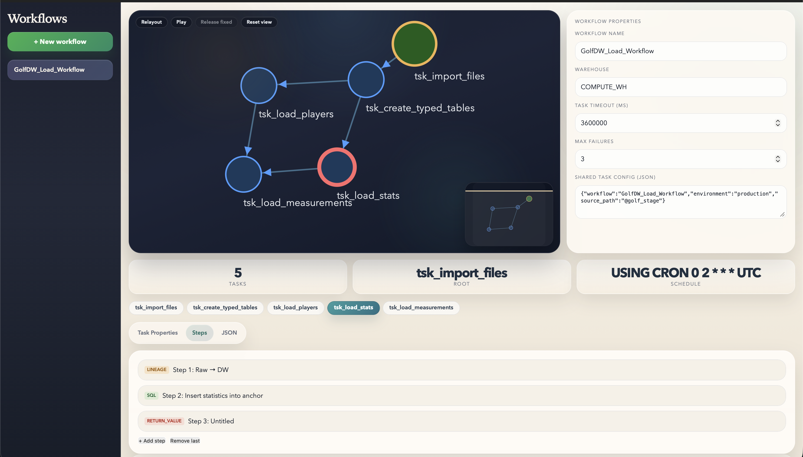

# sisula-snowflake

Sisula for Snowflake: a template renderer, deployment surface, and workflow editor for generating and managing Snowflake task graphs from JSON workflow definitions.



## What This Repo Contains

- A Snowflake implementation of the Sisula templating engine, exposed through the `SISULATE` function and helper procedures.
- A task-graph template flow that renders workflow JSON into Snowflake `CREATE TASK` SQL.
- Metadata deployment SQL for logging and workflow support tables.
- A local browser-based workflow editor for inspecting and editing workflow graphs.

## Core Docs

- [Sisula language reference](docs/SISULA.md)
- [Workflow JSON format](docs/WorkflowFormat.md)

Use `docs/SISULA.md` as the primary language reference for the Snowflake Sisula engine.

## Repo Layout

- `sql/`: deploys the Snowflake Sisula engine and SQL-based tests.
- `templates/`: Sisula templates, including `CreateTaskGraph.sql`.
- `metadata/`: metadata schema, model, knot values, logging procedures, and configuration procedures.
- `src/`: the JavaScript Sisula renderer used for local rendering and testing.
- `examples/`: example workflow bindings and rendered SQL output.
- `local/`: the local workflow editor, backend, and frontend assets.
- `sisula-mssql/`: the older SQL Server CLR implementation kept as a reference implementation and compatibility baseline.

## Typical Flow

1. Deploy the Snowflake Sisula engine.
2. Deploy the metadata objects if you want workflow logging and task-graph support.
3. Author or edit workflow JSON.
4. Render and optionally deploy task graph SQL from the workflow definition.
5. Use the local editor to inspect or edit workflows visually.

## Scripts

### Snowflake repo scripts

| Script | Purpose | Notes |
|---|---|---|
| `deploy.sh` | Deploys the Snowflake Sisula engine from `sql/deploy.sql`. | Requires the Snowflake CLI `snow` and a configured connection name. |
| `deploy_metadata.sh` | Deploys the metadata schema and supporting procedures from `metadata/`. | Runs the install steps in order, seeds `CreateTaskGraph` into metadata template storage, and stops on the first failure. |
| `install.sh` | Renders workflow JSON files with a Sisula template and optionally deploys the generated SQL. | Default template is `CreateTaskGraph`; `--dry-run` writes SQL to `<directory>/rendered/`. |
| `test_all.sh` | Runs the Snowflake SQL test suite in `sql/`. | Validates deployed behavior in Snowflake. |
| `test_local.js` | Runs a local Node.js smoke test against `src/sisula.js`. | Fast check for parser and renderer behavior without Snowflake. |
| `local/run.sh` | Starts the local workflow editor and API server. | Creates `local/.venv` on first run and serves the editor on `http://localhost:8000/` by default. |

### Legacy reference scripts

These belong to the SQL Server CLR reference implementation in `sisula-mssql/` rather than the Snowflake deployment path:

| Script | Purpose |
|---|---|
| `sisula-mssql/scripts/build.ps1` | Builds the SQL CLR assembly from `clr/SisulaRenderer.cs`. |
| `sisula-mssql/scripts/install.ps1` | Installs the SQL CLR assembly and function into SQL Server. |
| `sisula-mssql/scripts/format-json.ps1` | Pretty-prints JSON from the clipboard in PowerShell. |

## Quick Start

### 1. Deploy the Sisula engine

```bash
./deploy.sh <connection_name>
```

### 2. Deploy metadata support

```bash
./deploy_metadata.sh <connection_name>
```

### 3. Render or deploy workflow SQL from JSON

```bash
./install.sh <connection_name> ./examples --dry-run
./install.sh <connection_name> ./examples --template CreateTaskGraph
```

### 4. Run tests

```bash
./test_all.sh <connection_name>
node test_local.js
```

### 5. Start the local workflow editor

```bash
./local/run.sh <connection_name>
```

## Requirements

- Snowflake CLI `snow`
- Node.js for `test_local.js` and local rendering
- Python 3 for the local editor backend
- A configured Snowflake connection name available to the CLI and local editor

## Stale Script Assessment

I did not find any obviously stale executable scripts in the active Snowflake surface of this repo.

- `deploy.sh`, `deploy_metadata.sh`, `install.sh`, `test_all.sh`, and `local/run.sh` all point at files and directories that currently exist.
- The shell scripts pass `bash -n` syntax validation.
- `test_local.js` runs successfully against `src/sisula.js`.

One distinction is worth keeping clear:

- The PowerShell scripts under `sisula-mssql/scripts/` are legacy SQL Server support scripts, not part of the Snowflake deployment path. They do not look stale inside that subproject, but they should be treated as reference tooling rather than current Snowflake tooling.
