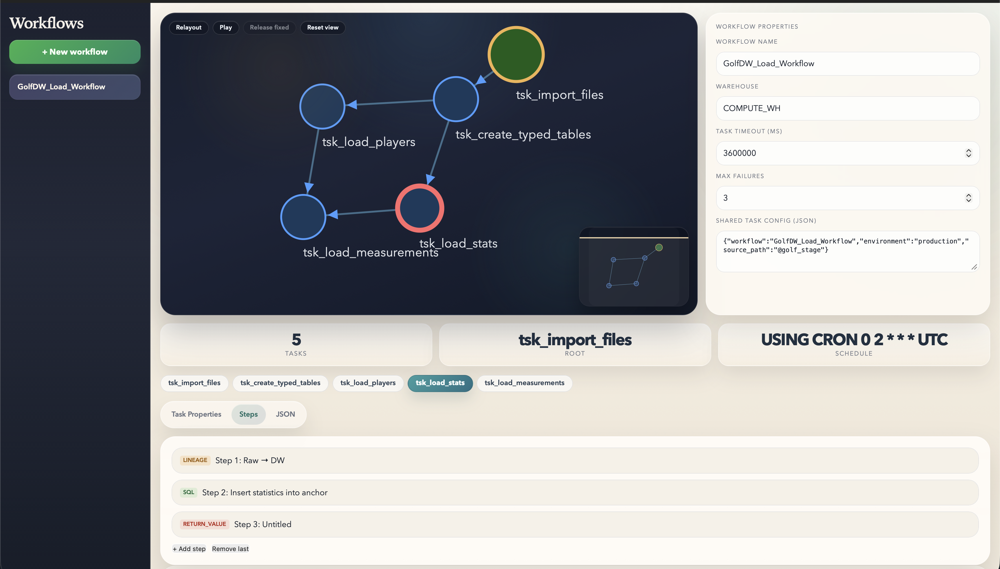

<center></center>

# Workflower

Sisula for Snowflake: a template renderer, deployment surface, and workflow editor for
generating and managing Snowflake task graphs from JSON workflow definitions.



## What This Repo Contains

- A Snowflake implementation of the Sisula templating engine, exposed through the
  `SISULATE` function and helper procedures.
- A task-graph template flow that renders workflow JSON into Snowflake `CREATE TASK` SQL.
- Metadata deployment SQL for logging, configuration storage, and workflow support tables.
- A browser-based workflow editor, served by a small PowerShell HTTP server.

## Requirements

- **Snowflake CLI** (`snow`), with a configured connection profile
- **Windows PowerShell 5.1** or later
- Node.js 18+ only to run the JavaScript regression tests

There is no Python or bash dependency. Everything runs with what a Windows Server
installation provides plus the Snowflake CLI.

## Core Docs

- [Sisula language reference](docs/SISULA.md)
- [Workflow JSON format](docs/WorkflowFormat.md)
- [PowerShell backend architecture](docs/PowerShellArchitecture.md)

## Repo Layout

- `sql/`: deploys the Snowflake Sisula engine.
- `metadata/`: the anchor model and its generator, plus knot values, logging,
  configuration, stage, import and retention procedures.
- `webapp/`: the editor UI, the PowerShell server and handlers, and browser assets.
- `webapp/templates/`: template sources deployed into Snowflake metadata storage; also used
  for the browser's offline preview.
- `tests/`: the JavaScript and SQL test suites.
- `examples/`: example workflow bindings.

## The metadata model

Everything the metadata schema stores is anchor modelled. `metadata/MetadataModel.xml` is
the source of truth and `metadata/Install_2_MetadataModel.sql` is generated from it by the
[Anchor Modeling](https://www.anchormodeling.com/modeler/test) tool, targeting Snowflake.

Regenerate it without opening the modeler:

```
npm install
npm run generate-model
```

`metadata/generate.js` runs the modeler's own Sisulator and its published Snowflake scripts
locally, caching them under `metadata/.anchor/`. Use `--refresh` to re-fetch them.

Because the generated DDL uses `CREATE TABLE IF NOT EXISTS`, changing an existing
attribute's temporalization requires dropping its table before redeploying; the generator
will not alter one in place.

### Runs are recorded

Every task execution records when it started, when it finished, its outcome and any error,
and the generated task body has an exception handler that records a failure and re-raises
so Snowflake still fails the task. Reporting views answer the questions directly:

| View | Question |
|---|---|
| `metadata.TaskRuns` | What ran, when, for how long, and did it work? |
| `metadata.GraphRuns` | Did last night's graph succeed? |
| `metadata.Lineage` | What did each task read and write, and how many rows? |
| `metadata.ContainerFlow` | What feeds what — impact analysis |
| `metadata.Installations` | What was deployed, when, and how did it go? |

```sql
SELECT WORKFLOW, STATUS, TASKS, FAILED, STARTED_AT
FROM metadata.GraphRuns ORDER BY STARTED_AT DESC LIMIT 10;
```

A run with no status is still running or died without being able to report. The editor's
**Runs** tab shows the same history for the open workflow.

### Environments

The same workflow installs into dev and production without being edited. An environment is
a configuration whose keys are merged over the workflow's own at render time:

```json
{ "NAME": "production", "WAREHOUSE": "ETL_WH", "TASK_TIMEOUT": 7200000, "MAX_FAILURES": 1 }
```

`PUT /api/environments` stores one; the editor's environment picker chooses which to
install with. Environment keys win over the workflow's, and the whole environment is also
exposed to templates as `$ENV.<key>$`.

Changing where something runs is then a two-step loop that never touches the workflow:

1. `PUT /api/environments` with the same `NAME` — it upserts in place, keeping its `CF_ID`.
2. Reinstall the workflow with that environment selected.

The rendered DDL picks up the new values and the stored workflow is unchanged, so the same
definition can be pointed at a different warehouse, timeout or failure cap per environment.
Because a task's warehouse comes from its DDL rather than from your connection, moving
existing tasks to another warehouse means reinstalling them — which is exactly what this
loop is for.

### Validation

A graph is validated before anything is rendered: duplicate names, predecessors that do
not exist, more than one root, cycles, a schedule on a non-root task, and steps missing
required fields. An invalid workflow is refused with the list of problems rather than
discovered halfway through applying the DDL. **More → Validate graph** checks on demand.

### Operating an installed workflow

**More → Task states…** reports what each task is actually doing, and offers Resume,
Suspend and Run now. Resume enables children before the root and suspend does the reverse,
so a graph is never able to fire with a partially enabled body.

`Run now` needs the `EXECUTE TASK` privilege granted to the task owner's role; without it
the reason is reported rather than failing silently.

### Installations are recorded

Every render creates an `IL_Installation`, tied to the configuration it came from and the
template applied, holding the run id, the rendered DDL, when it was rendered, its outcome
and any error. The record outlives the staged file, so pruning the stage does not lose the
audit trail:

```sql
SELECT LEFT(il.IL_RID_Installation_RunId, 8) AS RUN,
       cf.CF_NAM_Configuration_Name          AS WORKFLOW,
       COALESCE(il.IL_STA_ILS_InstallationStatus, 'not reported') AS STATUS,
       il.IL_RAT_Installation_RenderedAt     AS RENDERED_AT
FROM metadata.lIL_Installation il
LEFT JOIN metadata.IL_installs_CF_configuration t ON t.IL_ID_installs = il.IL_ID
LEFT JOIN metadata.lCF_Configuration cf ON cf.CF_ID = t.CF_ID_configuration
ORDER BY il.IL_RAT_Installation_RenderedAt DESC;
```

An installation with no status was rendered but never reported back on. `Failed` means
partially applied, since execution stops at the first failing statement and leaves earlier
ones in place.

## Quick Start

### 1. Deploy the Sisula engine

```
.\deploy.ps1 <connection_name>
```

### 2. Deploy metadata support

```
.\deploy_metadata.ps1 <connection_name>
```

This creates the metadata model, the `WORKFLOWER` stage, the file formats, the logging and
configuration procedures, and seeds the `CreateTaskGraph` template.

### 3. Start the editor

```
.\webapp\run.ps1 <connection_name>
```

Serves the editor on `http://localhost:8000/`.

### 4. Render or deploy workflow SQL from JSON

```
.\install.ps1 <connection_name> .\examples -DryRun
.\install.ps1 <connection_name> .\examples
```

Both use the **deployed** template in Snowflake metadata storage, so deploy metadata
support first. The installer writes the rendered SQL locally before executing and stops on
the first failure. It does not save its input as a configuration; save it through the
editor if you want it in the workflow library.

### 5. Import existing Snowflake tasks

```
.\read.ps1 <connection_name> .\imported -Schema MY_DATABASE.MY_SCHEMA
.\read.ps1 <connection_name> .\imported -Schema MY_DATABASE.MY_SCHEMA -Root ROOT_TASK
```

Read-only: it uses `SHOW TASKS` and `GET_DDL` and never alters a task. It creates one JSON
file per graph and refuses to overwrite existing files. Snowflake only exposes tasks
visible to the current role, so an entirely hidden child cannot be discovered and makes the
export fail rather than emit a partial graph.

Use **Import workflow JSON** in the editor to open an exported file. Native tasks run
directly without Workflower's logging wrappers; their `GET_DDL` header is preserved and
shown read-only. Imports default to **suspended**, with the original state kept as
metadata. Referenced procedures, tables, streams, integrations and grants are not exported
or reconstructed.

### 6. Run tests

```
.\tests\test_all.ps1 <connection_name>
npm test
```

`tests\test_all.ps1` runs the SQL suite in `tests/sql/`. Most of those files render
templates and print the result for inspection; `tests/sql/test_escaping.sql` asserts,
reporting a `STATUS` column that the runner checks. `npm test` runs the JavaScript suites,
which need Node and so are a development-machine check rather than part of deployment.

## Architecture

The browser talks to a local PowerShell server, which shells out to the Snowflake CLI.

**No user data is ever interpolated into SQL.** The Snowflake CLI has no bind variables, so
instead of escaping values, payloads travel as staged files and objects are addressed by
their integer `CF_ID`. The only values that reach SQL from the client are integers and
GUIDs, both validated at the point of use.

Saving uploads the document to `@metadata.WORKFLOWER/in/<run_id>.json`; Snowflake reads the
workflow name out of the document and stores the original bytes. Installing renders to
`@metadata.WORKFLOWER/out/<run_id>.sql` and runs it with `EXECUTE IMMEDIATE FROM`.

All SQL is passed to the CLI through a temporary `.sql` file. `snow sql -q` corrupts dollar
signs, which matters for a template language built on `$token$` whose procedures are
delimited by doubled dollars.

Rendered SQL is kept on the stage as an audit trail of exactly what was executed.

### Stage retention

Snowflake has no expiry for staged files — storage lifecycle policies apply to table rows,
not to stages. `LIST` and `REMOVE` are both rejected inside a stored procedure, so the
prune cannot be a Snowflake task either. It is a script you schedule:

```
.\prune.ps1 <connection_name> -WhatIf
.\prune.ps1 <connection_name>
```

Defaults keep `out/` for 90 days and `in/` and `export/` for 7. `out/` holds the SQL that
was actually executed and is the audit trail; `in/` duplicates a configuration already
stored historized in the metadata model, and `export/` has already been downloaded.

To see what is there before choosing a window:

```sql
ALTER STAGE metadata.WORKFLOWER REFRESH;
SELECT AREA, COUNT(*) AS FILES, SUM(BYTES) AS BYTES, MAX(AGE_DAYS) AS OLDEST_DAYS
FROM metadata.WORKFLOWER_STAGE_FILES GROUP BY AREA;
```

On the server, schedule `prune.ps1` with Windows Task Scheduler.

### Installation is not atomic

`EXECUTE IMMEDIATE FROM` stops at the first failing statement and **leaves earlier
statements applied**. Failures are reported with the line Snowflake named and the run id of
the rendered file, never retried automatically. Inspect Snowflake before retrying.

### Connections

The server has no connection pool and no session of its own. Each operation invokes `snow`,
which authenticates from the named profile in `~/.snowflake/config.toml`. The editor's
connection panel reports which user, role, database and warehouse the server is acting as.

For an unattended server, prefer key-pair authentication in the connection profile. See the
[Snowflake CLI connection documentation](https://docs.snowflake.com/en/developer-guide/snowflake-cli/connecting/configure-connections).

### Security posture

The server binds to `127.0.0.1`, serves only an explicit allowlist of browser assets,
rejects cross-origin writes, and sets a restrictive CSP. It is a single-user administrative
tool with no authentication; shared hosting would require an authentication and
authorization design.

The server handles **one request at a time**, and each one shells out to the Snowflake CLI,
so concurrent requests from the browser serialise behind each other. That is fine for a
single-user tool but it means the editor issues its startup calls in sequence rather than
in parallel.

A non-administrator account may need a URL reservation before it can listen:

```
netsh http add urlacl url=http://127.0.0.1:8000/ user=DOMAIN\user
```

## Template escaping

Values interpolated into generated SQL must use an escaping token form. See
[docs/SISULA.md](docs/SISULA.md):

- `$'path'$` renders a quoted SQL string literal.
- `$|path|$` renders text that is safe on one SQL comment line.

The plain `$path$` form interpolates verbatim and is correct only where the value is
genuinely SQL, such as a step's `sql` or a native task body.
